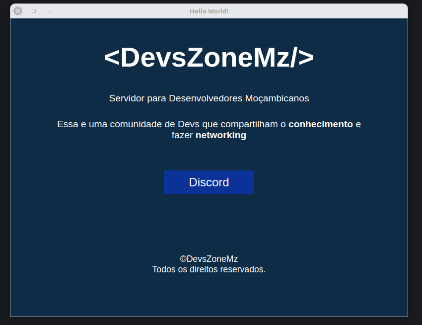

# Electron Hello World

Está é uma simples aplicação feita em Electron que mostra uma simples mensagem.
Antes de iniciar visite a documentacao <a href="https://www.electronjs.org/docs/latest/">Clica</a>
 
Para rodar em sua maquina voce precida baixar as dependencias necessarias usando o seguinte comando:  

<code>npm install</code>

 
Para poder rodar o programa sem fazer build é só usar o seguinte comando:  

<code>npm run start</code>

 
E para fazer o build:  
<code>npm run build</code>
Depois de executar o comando, é só entrar na pasta <strong>Packages</strong> e lá terá o seu executável. E já está.

 
 
 
Está simples aplicação foi desenvolvida pelos 3 fundadores da DevsZoneMz quando ficaram com a curiosidade de saber como são construídas aplicações em Electron.
